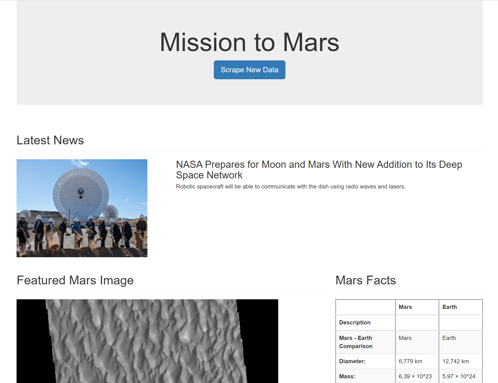

# Mission-to-Mars

## Objective

- The purpose of this project is to scrap information from diferent sources and present them in a webpage.

## Tools

- Jupyter Notebook
- Python
- Python Modules:
  - Flask
  - Pandas
  - Splinter
  - BeautifulSoup
- Bootstrap

## Results

- Page screenshot:

